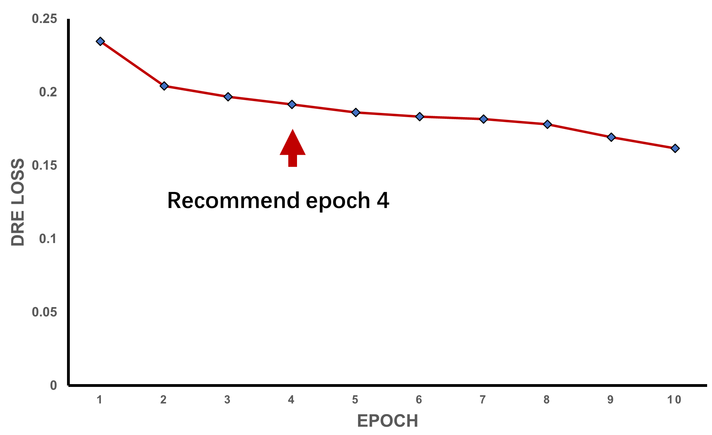

# self-adaptive fine-tuning of deep learning super-resolution microscopy for artifact suppression in live-cell imaging

## Introduction

Deep learning models can be used with different microscopy modalities to increase their spatial and temporal resolutions. 
However, artifacts that may be generated by deep learning models continue to raise significant concerns. 
While several methods have been developed to quantify artifacts, effective methods for suppressing artifacts are still lacking. 
Researchers have strived to enhance model performance in deep learning super-resolution (SR) microscopy by employing advanced architectures, 
, refining loss functions,  and using pretrained foundation models.
However, these strategies do not explicitly address the need to minimize artifacts. 
In practical applications, upon the deployment of a pretrained model for a local microscopy system, 
diverse user practices may result in large variations in imaging conditions. Such variations are also common in live-cell imaging. 
These conditions further complicate the issue of artifact minimization. 
In practice, training data that cover all usage scenarios and imaging conditions is time-consuming and impractical to obtain. 
However, when provided with inadequate training data, deep learning models may generate fuzzy image details and artifacts. 
To solve this problem, we propose a self-adaptive fine-tuning (SAFT) strategy . 
The core idea of SAFT is to use an evaluation metric to assess the quality of SR outputs during the inference stage and fine-tune the models 
to minimize the loss function on the basis of this evaluation. In daily use scenarios, after a pretrained SR network (SRN) is loaded onto a 
local microscope, the SAFT technique enables adjustments to the foundational model parameters to adapt to different imaging configurations 
as users load various fluorescence samples.

### Contributions 

Self-adaptive fine-tuning (SAFT).
SAFT was developed for practical deployment in deep learning SR microscopy. 
Each time a new sample is loaded, users can choose to apply the fine-tuning strategy 
to refine the pretrained foundational model for different imaging conditions. 
After raw LR fluorescence images are acquired, these images are utilized as training data for SAFT. 
SAFT generally requires between 2 and 10 iterations and takes 1 to 5 minutes to finish. 
The fine-tuned models are then deployed for SR reconstruction under similar imaging conditions. 
This strategy is particularly useful in laboratory settings where samples or imaging conditions frequently change.
SAFT is designed for artifact suppression in general imaging scenarios. 
Implementing this cyclic process involves adding a lightweight DEN and a resolution-scaled function (RSF) 
calculation. Regularization terms are utilized to improve spatiotemporal continuity and prevent resolution loss.
We typically stopped SAFT when the loss function had initially converged to prevent the model from overfitting.


## Environment

- **CUDA**: 11.1
- **Python**: 3.9.0
- **Pytorch**: 1.8.0
- **GPU**: GeForce RTX 3090
- **Dependencies**:  `requirements.txt`


- Since our fine-tuning method handles large-scale super-resolution videos, 
it demands substantial computational resources. In our latest iteration, 
we have optimized the fine-tuning process by reducing the batch size, 
thereby decreasing the GPU memory requirement. 
The demo can now be run on a GPU with 12 GB of memory 
(we have tested it on NVIDIA GeForce RTX 3060, NVIDIA GeForce RTX 3080, NVIDIA GeForce RTX 3090, NVIDIA A40).
  
- SAFT can be integrated with various SR models, its resource demands 
depend mainly on the architecture and input size of the chosen SR model. 
The capacity of GPU memory is also impacted by the size of the parameters in the denoising model. 
Larger batch sizes can enhance SAFT's performance, but they demand more computational resources.


- **For practical applications, we recommend using a high-performance GPU such as 
the Nvidia RTX 3090 or superior devices.**
These GPUs can support larger batch sizes and offer faster computation times, 
thereby improving the overall performance of the fine-tuning method.


## Install
1. Download the OnlineFinetuning_Demo.zip and unpack it. or clone this repository

   The directory tree should be:
   - `/Pretrained_model`: 
     Pre-trained SFSRM models can be downloaded at the figshare repository (https://doi.org/10.6084/m9.figshare.26946601.v5).
   - `/test_data`: test data
   - `/utils`: scripts folder
    
```
/
| --- image
| --- Pretrained_model # downloaded
| ...
```

2. Create and activate a virtual environment
   ```bash
   conda create -n saft python=3.9.0
   conda activate saft
   ```
3. Install Pytorch by pip command:
   ```bash
   pip install torch==1.8.0+cu111 torchvision==0.9.0+cu111 torchaudio==0.8.0 -f https://download.pytorch.org/whl/torch_stable.html
   ```
   **You can install the corresponding PyTorch version based on your specific GPU type. 
   However, please note that using a version that is too high may lead to compatibility issues.**
4. Install dependencies
   ```bash
   pip install -r requirements.txt -i https://pypi.tuna.tsinghua.edu.cn/simple
   ```
  
5. (optional) If you are linux platform, do the following thins:
	```bash
	sudo apt update
	sudo apt install ffmpeg
	sudo apt install libavcodec-extra
	pip install opencv-python-headless -i https://pypi.tuna.tsinghua.edu.cn/simple
	```
## Pre-trained SFSRM models


- In this demo, we combine online fine-tuning with a pre-trained SFSRM 
to suppress artifacts in SR reconstructions across 
various imaging scenarios. **SFSRM** was trained in the same manner as previously reported, to serve as the super-resolution network
for SAFT.We used fixed-cell data or simulated data as the training dataset, 
augmented by random cropping, rotation, and flipping.SFSRM took the concatenation of a 
low-resolution (LR) image and its edge map, which were reconstructed using the 
NanoJ-SRRF plugin in ImageJ, as a dual-channel input(Ring radius was set to 1 and axes in ring was set to 5). 
Pre-trained SFSRM models can be downloaded at the figshare repository (https://doi.org/10.6084/m9.figshare.26946601.v5).
**It is important to ensure the integrity of the downloaded model parameters and test images, as corrupted data may lead to incorrect results.**
## Resolution scaling function (RSF). 
- In our method, the point spread function (PSF) for a given microscope was approximated as a Gaussian function. 
The RSF was used to convert the PSF of the reference SR images to the PSF of the LR images, 
which was also approximated as a Gaussian function. Researchers have proposed the use of RSF to
degrade downsampled SR images to the same resolution as the LR images. In our experiments, 
we first downsampled the SR images to match the size of the LR images. We then measured the intensity 
profiles of 20-100 selected regions in both the SR and LR images. To align these profiles, we used the RSF, 
which was optimized to minimize the differences between the intensity profiles of the blurred SR images and the LR images. 
For rapid and accurate calculation of the RSF, we also recommend the use of NanoJ-SQUIRREL. This software is designed to assess and improve the quality of SR images efficiently and can be downloaded from 
the https://github.com/superresolusian/NanoJ-SQUIRREL/releases/tag/v1.1-alpha. For details, please see the documentation for NanoJ-SQUIRREL.


## Fine-tuning steps

1. **Run run.py**
   ```bash
   CUDA_VISIBLE_DEVICES=0 python run.py
   ```
   **Users can specify the GPU device for SAFT based on actual requirements**
   

2. **If the service is running on a remote server, you must first establish an SSH tunnel to access it locally through the link**.
   
```bash
   ssh -L {port}:127.0.0.1:{port} {user_name}@{server_ip}
   ```
   
3. **Copy the link and open the app in your browser**:
   

4. **Correctly configure parameters and start fine-tuning and super-resolution reconstruction procedures**

   - **SAFT/WSF**: Select the SAFT mode.
     
   - **File**
     
      - `LR_Img`: imagedir of the LR image for SAFT
      - `Edge_Img`: imagedir of the edgemap for SFSRM
      - `SMLM_Img`: imagedir of the live-cell smlm image for SAFT-WSF
      - `ResultDir`: imagedir for saving the results
      - `Super-Resolution model`: datadir of the pretrained SFSRM model
      - `Denoising model`: datadir of the pretrained denoising model
      
   - **Parameters**
      - `iteration_times`: iteration times of the SAFT (default 5)
        
        - Longer iteration times are known to improve the performance of SAFT. 
          However, a decrease in resolution often accompanies extended fine-tuning. 
          To counteract this, we generally stop the SAFT process when the loss function first reaches convergence, 
          which helps avoid overfitting.
        
      - `SRlr`: learning rate for the fine-tuning of SFSRM (default 1e-5)
        
        - A larger learning rate can accelerate the iteration time of SAFT, 
          effectively reducing the total computation time. 
          However, it poses the risk of gradient explosion, which can cause training failures. 
          To mitigate this risk, we recommend setting the learning rate no higher than 1e-3.
        
      - `sigma`: Gaussian sigma of the RSF before upsampling. (default 1.1)
        - The RSF is used to convert the PSF of the reference SR images to the PSF of the LR images, 
            which is also approximated as a Gaussian function. Further details are available in our paper.

      - `ksize`: kernal size of the RSF (default 5)
        - The kernel size needs to be aligned with the Gaussian sigma and should always be an odd number. 
          Typically, we set the kernel size (ksize) to 2 * sigma + 1 to achieve this.
        
      - `continuity_level`: level of the continuity regularization term (default 1)
        - Continuity level is used to constrain spatiotemporal continuity in the SR outputs during fine-tuning. 
        Random adjacent frame sequences (default 5) were used for the calculation of Hessiain regularization.
        A larger continuity value will improve the smoothness and consistency in SR videos. However, it may also result in a decrease in resolution quality.
        
      - `sparse_level`: level of the sparse regularization term (default 1)
        - Sparse_level is designed to improve the resolution of SR reconstructions on the basis of the theory that fluorescence images with high resolutions
        exhibit high levels of sparsity. We modified this variable to constrain the sparsity similarity between 
        the original SRN outputs and the SAFT outputs to avoid resolution degradation during artifact-suppressed fine-tuning.
        A larger sparse level will enhance the sharpness of image details. 
          However, it may also negatively impact the true signals present in the images.
        
      - `consistency_level`: level of the consistency regularization term (default 1)
        - SMLM training labels inherently contain background localization noise,
          causing GAN-based super-resolution models to generate fake background artifacts. 
          These artifacts display varying distributions when LR inputs are rotated. 
          To address this issue, consistency_level is used to minimize discrepancies among super-resolution outputs 
          of rotation-augmented images. Intuitively, the inverse rotation of the network outputs from 
          rotated images should match the outputs from nonrotated images, and consistency_level is used to rectify 
          artifacts generated from rotation. It is worth noting that rotation-related artifacts may not be as apparent in other microscopy data 
          or when using other SR models. Depending on the specific usage conditions, further modifications may be needed.
        
     - **We have conducted an ablation study to demonstrate how each regularization term in SAFT affects 
        the reconstruction results. Detail results are showed in our manuscript.**

   - **FineTuning**: Click the **FineTuning** button to perform SAFT. The results of each iteration will be displayed.
   
   - **Result images**: The fine-tuning images are also available in your results directory, saved with the filename xxxx_SRN_fine-tuning.
   
     
   - **Loss**: To monitor the loss changes over time, check your results directory for the file named SFSRM-SAFT_Finetuning_Record.csv.
     To avoid overfitting, we generally end the SAFT process when the loss function initially stabilizes at convergence. 
     We advise the following configurations for the demo images:
     - **For KDEL images**, set the learning rate to 1e-5 and perform 4 iterations.
     - **For TOMM20 images**, apply the same parameters: a learning rate of 1e-5 and 4 iterations.
     

   
     

   - **Super Resolution**: Select a satisfactory SAFT iteration and click the SuperResolution button. 
     We advise selecting the SAFT iteration that yields satisfactory performance, based on an analysis of both the loss variations and the model outputs.
     The model corresponding to the selected iteration will be used to reconstruct super-resolution video.
   
   - **Reconstruction results**: For the SR images, look for the file named xxxx_SuperResolution. The SR video can be found in a file named mp.
   
   - **Reconstruction times**:
   Users are able to monitor the training and testing duration through the progress bar in the command line interface.
   
     
     


